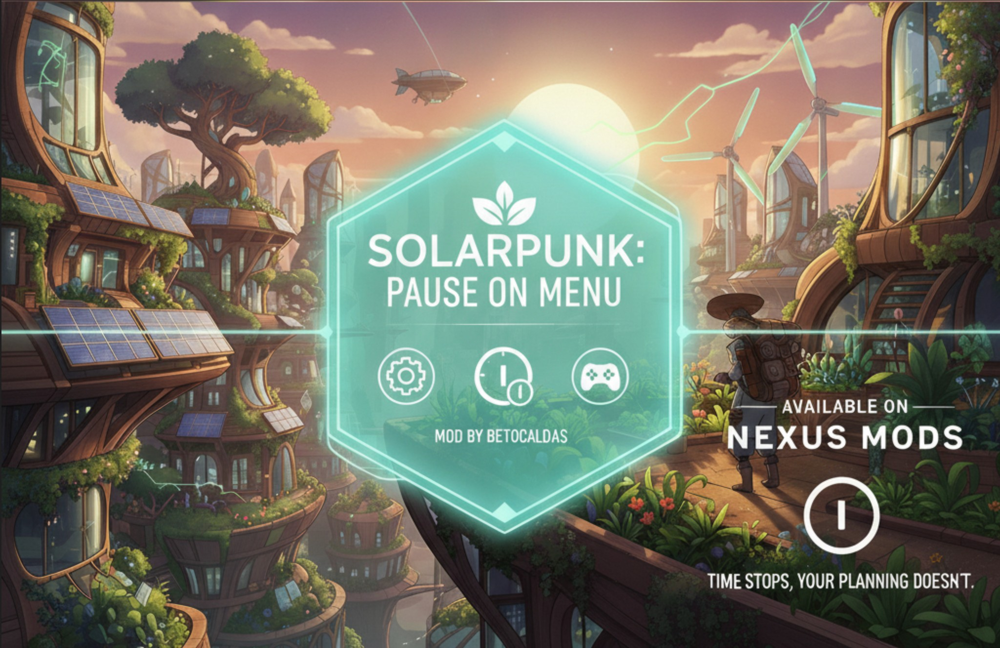

# SolarpunkPauseOnMenu

Pauses the game when the ESC menu is shown and unpauses when it is closed.

## Demo

[](https://youtu.be/DE7aQ7MiXJo)

Watch the mod in action: [YouTube — SolarpunkPauseOnMenu](https://youtu.be/DE7aQ7MiXJo)

Solarpunk is built on **Unreal Engine 5** and packaged with IoStore (`.utoc` / `.ucas` / `.pak`).
The game does not ship a native mod system, so this mod runs through **UE4SS**
(Unreal Engine 4/5 Scripting System) using Lua scripts.

- UE4SS documentation: https://docs.ue4ss.com
- Lua mod guide: https://docs.ue4ss.com/guides/creating-a-lua-mod.html

---

## Requirements

- **Solarpunk** (Steam), installed locally
- **UE4SS** installed in the game's shipping `Win64` folder (see below)
- **UE4SS experimental build** — the stable release does **not** work with SolarPunk's engine (UE **5.7.1**). Minimum tested version: **`UE4SS_v3.0.1-954-g272ce2f8`**, or any newer experimental build that supports UE 5.7.1. Download from the [UE4SS releases page](https://github.com/UE4SS-RE/RE-UE4SS/releases) (`experimental-latest` or a newer experimental package)
- **Custom UE4SS signatures** for UE 5.7.1 — Pattern Sleuth in the stable/experimental builds may fail to resolve critical globals on this game. Use the scripts in `tools/` with the game's `.pdb` to generate `UE4SS_Signatures/*.lua` (see [Advanced: UE4SS signatures](#advanced-ue4ss-signatures-for-ue-571))
- **Engine version override** in `UE4SS-settings.ini`:
  ```
  [EngineVersionOverride]
  MajorVersion = 5
  MinorVersion = 7
  ```

> This repository contains **only the mod** (Lua scripts). UE4SS itself must be downloaded and installed separately.

The real game executable is the shipping binary, not the root launcher:

```
<Steam>\steamapps\common\Solarpunk\Solarpunk\Binaries\Win64\SolarpunkSteam-Win64-Shipping.exe
```

UE4SS must be installed next to that executable.

---

## 1. Install UE4SS

1. Download **`UE4SS_v3.0.1-954-g272ce2f8`** (minimum tested) or a newer experimental build
   that supports UE 5.7.1 from:
   https://github.com/UE4SS-RE/RE-UE4SS/releases
   (the `experimental-latest` asset is fine if it is equal to or newer than that version)
2. Extract into:
   ```
   <Steam>\steamapps\common\Solarpunk\Solarpunk\Binaries\Win64\
   ```
   After extraction, that folder should contain (among others):
   ```
   Solarpunk\Binaries\Win64\
       dwmapi.dll            (UE4SS proxy)
       UE4SS.dll
       UE4SS-settings.ini
       Mods\
           mods.txt
           shared\
           (example mods)
   ```
3. Set the engine version override in `UE4SS-settings.ini` (see [Requirements](#requirements)).
4. If UE4SS hangs at startup or logs `PS Scan failed`, generate custom signatures (see [Advanced](#advanced-ue4ss-signatures-for-ue-571)).

> If the game does not start with `dwmapi.dll`, try renaming the proxy to another
> supported name (e.g. `xinput1_3.dll`). See the UE4SS installation docs.

---

## 2. Install this mod

### Option A: Download the release zip (recommended)

Go to [GitHub Releases](https://github.com/BetoCaldas-Mods/SolarpunkPauseOnMenu/releases)
and download **`SolarpunkPauseOnMenu.zip`**. It contains only what is needed to run the mod:

```
README.md                   (quick install guide)
SolarpunkPauseOnMenu/
    enabled.txt
    scripts/
        main.lua
```

The zip README (`release/README.md` in the repo) is a short end-user guide.
The full developer documentation stays in this repository README.

Extract and copy the `SolarpunkPauseOnMenu` folder into:
```
<Steam>\steamapps\common\Solarpunk\Solarpunk\Binaries\Win64\Mods\
```

> The automatic **Source code (zip)** on GitHub includes the full repository (tools,
> scripts, dev config). Use the **release asset** `SolarpunkPauseOnMenu.zip` instead.

### Option B: Clone the repository

1. Copy the `SolarpunkPauseOnMenu` folder from this repository into:
   ```
   <Steam>\steamapps\common\Solarpunk\Solarpunk\Binaries\Win64\Mods\
   ```
   Result:
   ```
   ...\Win64\Mods\SolarpunkPauseOnMenu\
       enabled.txt
       scripts\main.lua
   ```
2. Enable the mod (either method works):
   - **`enabled.txt`** (included): UE4SS loads the folder automatically; or
   - **`mods.txt`**: open `...\Win64\Mods\mods.txt` and add the line
     (see `mods.txt.exemplo`):
     ```
     SolarpunkPauseOnMenu : 1
     ```

---

## 3. UE4SS debug consoles (automatic)

UE4SS can show two debug windows (text console + GUI). This repo toggles them
automatically between development and release:

| When | Consoles | Git `config/console-mode.txt` |
|---|---|---|
| Developing locally | **ON** | `dev` (local only, not pushed) |
| `git push` | **OFF** (local + committed) | `release` |

### One-time setup

1. Install git hooks:
   ```powershell
   .\scripts\install-hooks.ps1
   ```
2. Copy `config/game-path.local.example` to `config/game-path.local` and set the
   full path to your `UE4SS-settings.ini` (the install script creates this if missing).

### During development

- Opening this project in **Cursor** syncs consoles from `config/console-mode.txt`
  (`sessionStart` hook; does not override `release` after a push).
- Switching git branches enables consoles (`post-checkout` hook).
- Or run manually: `.\scripts\dev-start.ps1` (dev) or
  `.\scripts\ue4ss-console.ps1 -Mode Release` (off).

Reference values are in `config/ue4ss-debug.dev.ini` and `config/ue4ss-debug.release.ini`.

### On push

The `pre-push` hook disables consoles on your machine, sets `config/console-mode.txt`
to `release`, and auto-commits that file if needed. End users should keep consoles
**off** (see `config/ue4ss-debug.release.ini`).

---

## 4. Discover the pause menu widget name (optional, for `detect` mode)

The mod defaults to `toggle` mode (ESC toggles pause). To sync automatically with
menu visibility, switch to `detect` mode.

For `detect` mode to work reliably, the mod must recognize the **widget class name**
of the pause menu:

1. Start the game (load a save until you can move).
2. Open the menu with **ESC**.
3. With the menu open, press **F8** (this mod's discovery key).
4. Check the UE4SS console. It lists widgets currently in the viewport, e.g.:
   ```
   [SolarpunkPauseOnMenu] --- Widgets VISIVEIS na viewport ---
   [SolarpunkPauseOnMenu]   WBP_PauseMenu_C
   [SolarpunkPauseOnMenu]   WBP_HUD_C
   ```
5. Identify the pause menu widget (e.g. `WBP_PauseMenu_C`, `EscMenu_C`).
6. Open `SolarpunkPauseOnMenu\scripts\main.lua` and add a lowercase substring of
   that name to `Config.menuWidgetPatterns`. Example:
   ```lua
   menuWidgetPatterns = {
       "pausemenu",   -- matches WBP_PauseMenu_C
   },
   ```
7. Save and reload mods (**Ctrl+R** if hot reload is enabled in `UE4SS-settings.ini`)
   or restart the game.

> The mod already tries common patterns. If your menu matches one of them, `detect`
> mode may work without changes.

---

## 5. Mod modes

At the top of `scripts/main.lua`, in `Config.mode`:

- **`"toggle"`** (default): toggles pause on each **ESC** press. Works without knowing
  the widget name, but can desync if the menu is closed with the mouse (press ESC again).
- **`"detect"`**: detects the visible menu widget and syncs pause automatically,
  regardless of how the menu is opened or closed (ESC, mouse, Resume button).
  More robust, but requires `menuWidgetPatterns` to match only the pause menu.

Other options:
- `discoverKey`: key to list viewport widgets (default `F8`).
- `pollIntervalMs`: poll interval in `detect` mode (default 200 ms).
- `debug`: enable/disable console logs.

---

## 6. Troubleshooting

- **Nothing happens / no logs**: confirm UE4SS loaded (console opened) and the mod
  appears as loaded. Make sure files are in the `*-Shipping.exe` folder, not the root launcher.
- **UE4SS fails at startup / `PS Scan failed`**: SolarPunk uses UE 5.7.1. Use
  `UE4SS_v3.0.1-954-g272ce2f8` or a newer experimental build, set the engine override
  to 5.7, and generate custom signatures.
- **Stuck at "Waiting for object construction..."**: Pattern Sleuth found a wrong
  `GUObjectArray` address. Regenerate `GUObjectArray.lua` with `tools/gen_guobjectarray.py`.
- **F8 lists nothing**: the menu may not be a standard `UserWidget`; open the menu
  before pressing F8 and make sure the game window has focus.
- **Pauses on wrong menus (inventory, etc.)**: narrow `menuWidgetPatterns` to match
  only the ESC pause menu.
- **Multiplayer**: `SetGamePaused` only works in single-player/standalone. Online
  sessions ignore engine pause.

---

## Advanced: UE4SS signatures for UE 5.7.1

SolarPunk ships with a `.pdb` next to the shipping executable. The Python scripts in
`tools/` read symbol addresses from that PDB and generate custom AOB signature files
for UE4SS:

| Script | Generates |
|---|---|
| `tools/gen_signatures.py` | `FName_Constructor.lua`, `StaticConstructObject.lua` |
| `tools/gen_guobjectarray.py` | `GUObjectArray.lua` |
| `tools/resolve_globals.py` | Compares PDB addresses vs Pattern Sleuth (diagnostic) |

Place the generated `.lua` files in:
```
...\Win64\ue4ss\UE4SS_Signatures\
```

Re-run the scripts after a game patch that changes the shipping executable.

---

## Publishing a release (maintainers)

A GitHub Action builds the minimal mod zip automatically when you push a version tag:

```powershell
git tag v1.0.0
git push origin v1.0.0
```

The workflow `.github/workflows/release.yml` will:

1. Validate mod files and `release/README.md` exist
2. Create `SolarpunkPauseOnMenu.zip` (mod folder + minimal `README.md`)
3. Publish a GitHub Release with that zip attached

Test locally before tagging:

```powershell
.\scripts\build-release.ps1
```

You can also trigger the workflow manually from the **Actions** tab (`workflow_dispatch`).

---

## File layout

```
SolarpunkPauseOnMenu\             (repository)
    README.md
    assets\                       (screenshots and demo media)
    mods.txt.exemplo
    release\
        README.md                 (minimal guide bundled in release zip)
    config\
        console-mode.txt            (release in git; dev locally while working)
        game-path.local.example
        ue4ss-debug.dev.ini
        ue4ss-debug.release.ini
    .github\
        workflows\
            release.yml             (builds SolarpunkPauseOnMenu.zip on tag push)
    scripts\
        ue4ss-console.ps1           (toggle consoles on/off)
        dev-start.ps1               (enable consoles manually)
        install-hooks.ps1           (install git hooks)
        build-release.ps1           (build zip locally for testing)
    SolarpunkPauseOnMenu\           (copy to ...\Win64\Mods\)
        enabled.txt
        scripts\
            main.lua
    tools\                          (generate UE4SS signatures from PDB)
        gen_signatures.py
        gen_guobjectarray.py
        resolve_globals.py
```
